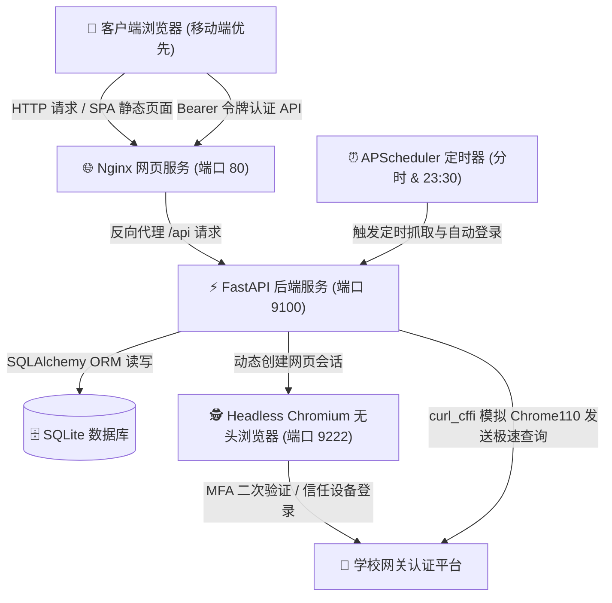

# WattDash - 智能电费监测分析平台 ⚡

WattDash 是一个专为高校宿舍设计的电费监测、智能分析与充值记账管理平台。系统采用前后端分离架构，集成了 **FastAPI 后端**、**Vue 3 前端控制台** 和 **DrissionPage + curl_cffi 异步爬虫**，完美适配 Linux 无头（Headless）部署环境，并具备定时自动同步和防漏登数学平衡计算功能。

## 🧱 系统架构拓扑



---

## 🌟 核心功能特性

1. **前后端分离现代化看板 UI**
   - 采用深色科技风格设计，界面支持响应式适配（手机、平板、PC 均能完美呈现）。
   - **分时与趋势双重分析**：支持“今日分时电量明细”及“历史趋势分析”双模看板。
   - **智能日期过滤**：支持指定任意日期查询当日的 24 小时分时折线，以及通过日历选择自定义的开始与结束日期进行历史拉取。
2. **ECharts 级联缩放与标值优化**
   - **自适应 Y 轴缩放 (`scale: true`)**：自动适配数据范围（例如在 35.48 至 35.61 元的极小范围内精细缩放），彻底消除折线“看起来像直线”的视觉死角，使微小用电波动一眼便知。
   - **节点与柱状图防重叠标值**：在折线点上方显式呈现电费余额，并把用电量数字优雅地包裹在紫色柱体顶端内侧（`insideTop`），完全避免字体重叠，读数极佳。
3. **⏰ 定时自动同步与静默自动登录**
   - APScheduler 会在每天的 **08:00, 10:00, 12:00, 14:00, 16:00, 18:00, 20:00, 22:00** 自动拉取最新的分时数据，并在 **23:30** 执行日终结汇计算。
   - **后台自动登录**：当后台任务检测到本地 JSESSIONID 失效时，它会**自动拉起无头 Chromium 浏览器**进行静默重新登录与 SSO 锁。若此前已信任该设备，后台将无缝静默换票，达成真正的无人值守数据拉取。
4. **💥 充值平抑与逆向追溯自愈（核心数学闭环）**
   - **充值平抑**：电费充值会导致余额突增，系统在日终结汇时将自动检索充值记录，通过 `当日耗电量 = 昨日余额 + 充值总额 - 今日余额` 自动平抑波动，保留真实用电消耗。
   - **漏登拦截警报**：如果发生电量突增却未在系统里进行“登记充值”，系统会拦截耗电量计算并抛出红色预警条。
   - **追溯自愈（Self-Healing）**：用户随后在前端补录该充值金额后，系统自动触发逆向追溯结算，重算该异常日期的电量消耗并自动解除报警。
5. **🗄️ 数据库持久化日志与时区对齐**
   - **SystemLog 模型**：放弃本地 LocalStorage，日志直接落库，前端每次操作和后台同步细节一目了然，并设定 100 条数据库记录的轻量级自动裁剪防爆机制。
   - **北京时区自动对齐**：系统内所有日志产生时间、更新时间，均自动由 UTC 时区转换并对齐为 `Asia/Shanghai` 东八区时间展示。
6. **📺 Linux Headless 调试与诊断机制**
   - **分步截图故事线 (Storyboard)**：无头浏览器启动时，会在 `./backend_data/screenshots/` 目录中按序号自动覆盖保存 `01_load_cas.png`, `02_submit_credentials.png`, `06_trust_modal.png` 等分步画面。登录出现任何故障，打开目录看图即可一目了然。
   - **移动端去空格防错**：自动对用户输入的用户名/密码进行 `.strip()` 去空格清洗，防止手机输入法在输入 `admin` 后自动添加不可见的尾随空格。

---

## 🧱 数据库模型设计

系统包含 5 张核心数据表：
*   `users`：管理 Web 账户信息、学校网关账密、查询房间 JSON 参数。
*   `electricity_records`：按天记录每日 23:30 结汇余额、扣平后的真实耗电、自愈报警标志及原因。
*   `recharge_records`：记录手动登记充值的金额、时间、以及是否已被日消耗量算法平抑的结算标记。
*   `intraday_balance_records`：存储每次分时查询（定时或手动）时捕获的电量余额快照。
*   `system_logs`：保存系统定时更新或手动操作日志，上限 100 条自动滚剪。

---

**1.`users`（用户配置表）**

*   **用途**：存储 Web 登录账户、网关加密账密以及您自定义设置的房间参数 JSON。
*   **结构**：

| 字段名             | 类型     | 约束            | 描述                                                     |
| :----------------- | :------- | :-------------- | :------------------------------------------------------- |
| `id`               | Integer  | Primary Key     | 用户唯一标识自增 ID                                      |
| `username`         | String   | Unique, Indexed | 登录系统用户名                                           |
| `hashed_password`  | String   | Not Null        | 加密后的账户登录密码                                     |
| `student_id`       | String   | Nullable        | 绑定的四川交通大学学号（网关账号）                       |
| `gateway_password` | String   | Nullable        | 网关登录密码                                             |
| `query_config`     | JSON     | Nullable        | 存储房间参数配置（`aid`, `area`, `building`, `room` 等） |
| `created_at`       | DateTime | default=now     | 账户创建时间                                             |
| `is_active`        | Boolean  | default=True    | 账户启用状态                                             |

---

**2.`electricity_records`（每日电费消耗结算表）**

*   **用途**：按天记录每日用电结算。是折线/柱状图历史趋势（7天/30天/自定义）和自愈计算的核心表。
*   **结构**：

| 字段名           | 类型     | 约束            | 描述                                                         |
| :--------------- | :------- | :-------------- | :----------------------------------------------------------- |
| `id`             | Integer  | Primary Key     | 记录唯一自增 ID                                              |
| `record_date`    | Date     | Unique, Indexed | 记录日期（格式 `YYYY-MM-DD`，每天仅有一条）                  |
| `balance`        | Float    | Not Null        | 每日 23:30 结汇时的电量余额（单位：度）                      |
| `consumption`    | Float    | Nullable        | 今日实际纯消耗电量（单位：度，已在后台自动进行了充值平抑）   |
| `is_abnormal`    | Boolean  | default=False   | 今日用电量自愈判定标记（若余额无故上涨且无充值登记则置为 `True`） |
| `anomaly_reason` | String   | Nullable        | 判定为异常原因描述（如：未登补录充值）                       |
| `created_at`     | DateTime | default=now     | 记录创建时间（UTC）                                          |
| `updated_at`     | DateTime | default=now     | 每次更新该数据的时间戳（UTC）                                |

---

**3. `recharge_records`（充值流水登记表）**

*   **用途**：保存您在控制台手动“登记充值”的所有流水记录，用作耗电自愈平衡的平抑基准。
*   **结构**：

| 字段名          | 类型     | 约束          | 描述                                       |
| :-------------- | :------- | :------------ | :----------------------------------------- |
| `id`            | Integer  | Primary Key   | 充值流水唯一自增 ID                        |
| `amount`        | Float    | Not Null      | 充值金额（单位：元）                       |
| `recharge_date` | DateTime | Not Null      | 充值的发生日期与时刻（支持追溯历史）       |
| `is_settled`    | Boolean  | default=False | 该笔充值是否已被耗电计算服务成功合并计算？ |
| `settled_at`    | DateTime | Nullable      | 发生自愈计算并完成对齐平衡的时间戳         |
| `created_at`    | DateTime | default=now   | 流水登记的物理写入时间                     |

---

**4. `intraday_balance_records`（今日分时明细表）**

*   **用途**：记录每天定时（8:00 - 22:00 每两小时）及手动刷新成功时捕获的细粒度电量余额。用于“分时明细”图表的呈现与“最后成功更新时间”的锚定。
*   **结构**：

| 字段名       | 类型     | 约束                 | 描述                                              |
| :----------- | :------- | :------------------- | :------------------------------------------------ |
| `id`         | Integer  | Primary Key          | 明细自增 ID                                       |
| `query_time` | DateTime | default=now, Indexed | 该次查询成功的准确物理时间戳（UTC，用于时区转换） |
| `balance`    | Float    | Not Null             | 此时此刻查到的最新电量余额（单位：度）            |

---

**5.`system_logs`（系统运行日志表）**

*   **用途**：替代本地 LocalStorage，持久化保存系统近期运行日志（展示在前端“系统运行日志”面板）。
*   **裁剪机制**：插入时会自动删除超过 100 条以前的旧记录，保持数据库轻量化。
*   **结构**：

| 字段名     | 类型     | 约束                 | 描述                                                         |
| :--------- | :------- | :------------------- | :----------------------------------------------------------- |
| `id`       | Integer  | Primary Key          | 日志自增 ID                                                  |
| `log_time` | DateTime | default=now, Indexed | 日志发生的准确物理时间戳                                     |
| `level`    | String   | Not Null             | 日志级别（`info` 灰色 / `success` 绿色 / `warning` 黄色 / `error` 红色） |
| `message`  | String   | Not Null             | 日志的详细文本信息                                           |

---

## 📁 项目目录结构

```
WattDash/
├── backend/                       # Python 后端项目
│   ├── app/
│   │   ├── api/                   # 路由接口 (auth, query, recharge, statistics)
│   │   ├── core/                  # 配置项、常量及 SQLAlchemy 引擎
│   │   ├── models/                # 数据库 ORM 模型 (User, Record, Recharge, SystemLog, IntradayBalance)
│   │   ├── schemas/               # Pydantic 校验和输出数据模型
│   │   ├── services/              # 核心业务 (爬虫、充值计算、定时任务、日志服务)
│   │   └── main.py                # FastAPI 启动主入口
│   └── requirements.txt           # 后端依赖列表
├── frontend/                      # Vue 3 前端项目
│   ├── src/
│   │   ├── assets/                # 全局样式及暗黑组件重写
│   │   ├── utils/                 # Axios 拦截器 (自动携带 Token、401重定向)
│   │   └── App.vue                # 单页面大看板核心代码 (图表集成、登录、设置)
│   ├── index.html                 # 模板页
│   ├── package.json               # 前端依赖列表
│   └── vite.config.js             # 开发反向代理配置
├── docker-compose.yml             # Docker 容器服务统一编排
├── backend.Dockerfile             # 后端 (Python 3.10-slim + Chrome + 中文字体)
├── frontend.Dockerfile            # 前端 (Vue 3 静态编译 + Nginx 代理)
└── README.md                      # 本说明文档
```

---

## ⚙️ 参数配置说明

### 1. 后端与 Docker 配置 (`docker-compose.yml`)
您可以在 `docker-compose.yml` 中修改以下环境变量：
- `SECRET_KEY`：JWT 签名密钥（生产环境建议更改）。
- `DATABASE_URL`：SQLite 数据库连接，默认为容器卷内路径 `sqlite:////workspace/backend/app/database/wattdash.db`。

### 2. 网关配置与房间查询 JSON 参数
登录后台后，可在**“网关设置”**中修改查询参数。默认解析的查询参数格式如下：
```json
{
  "aid": "0030000000002503",
  "area": "{\"area\":\"犀浦校区\",\"areaname\":\"犀浦校区\"}",
  "building": "{\"building\":\"鸿哲斋4号楼\",\"buildingid\":\"1\"}",
  "floor": "{\"floorid\":\"\",\"floor\":\"\"}",
  "room": "{\"room\":\"\",\"roomid\":\"041313\"}"
}
```
*提示：这些参数会在发送请求时，通过 `curl_cffi` 模拟的 HTTP POST 报文提交给高校电费查询 API。*

---

## 🚀 生产部署指南 (适用于 Alibaba Cloud Linux 4 / Ubuntu / CentOS)

### 1. 环境准备
确保您的服务器已安装 Docker 和 Docker Compose：
```bash
# 启动并使 Docker 开机自启
sudo systemctl start docker
sudo systemctl enable docker
```

### 2. 一键拉起服务
将本项目完整文件夹上传至服务器，在根目录下执行：
```bash
docker compose up -d --build
```
此命令将：
- 构建并编译前端静态资源，利用 Nginx 代理服务映射到宿主机 **`80`** 端口。
- 构建后端 Python 环境，自动安装 headless Chrome 依赖，映射宿主机 **`9100`** 端口。
- 自动创建宿主机挂载文件夹 `./backend_data` 用于持久化保存 SQLite 数据库与网关登录凭证 (token.txt)。

### 3. 服务日常运维与调试命令

在项目根目录下执行以下 Docker Compose 运维指令：

#### ⚙️ 服务状态管理
- **启动所有服务（后台运行）**：
  ```bash
  docker compose up -d
  ```
- **停止并移除所有服务容器**：
  ```bash
  docker compose down
  ```
- **重启所有服务**：
  ```bash
  docker compose restart
  ```
- **单独重启后端服务**（在修改爬虫/后台代码后）：
  ```bash
  docker compose restart backend
  ```
- **重新编译并拉起服务**（在修改 requirements.txt 或 Dockerfile 后）：
  ```bash
  docker compose up -d --build
  ```

#### 📊 状态与日志监控
- **查看运行中的容器列表**：
  ```bash
  docker compose ps
  ```
- **实时滚动查看所有服务日志**：
  ```bash
  docker compose logs -f
  ```
- **仅查看后端（爬虫及业务逻辑）的实时日志**：
  ```bash
  docker compose logs -f backend
  ```
- **仅查看前端 Nginx 静态代理日志**：
  ```bash
  docker compose logs -f frontend
  ```
- **监控容器资源（CPU、内存）占用**：
  ```bash
  docker stats
  ```

#### 🛡️ 容器内部运维（诊断与重置）
- **进入后端容器的命令行终端**：
  ```bash
  docker exec -it wattdash-backend bash
  ```
- **查询当前 SQLite 数据库中已注册的用户**：
  ```bash
  docker exec -it wattdash-backend python -c "from app.core.database import SessionLocal; from app.models.user import User; db=SessionLocal(); print('现有用户:', [u.username for u in db.query(User).all()])"
  ```
- **一键重置/强制恢复初始 admin 管理员（用户名: admin, 密码: admin）**：
  ```bash
  docker exec -it wattdash-backend python -c "from app.core.database import SessionLocal; from app.models.user import User; from app.core.security import get_password_hash; db=SessionLocal(); db.query(User).filter(User.username == 'admin').delete(); db.commit(); admin = User(username='admin', hashed_password=get_password_hash('admin'), student_id=None, gateway_password=None); db.add(admin); db.commit(); print('✨ 管理员账号 admin 已成功强制重置，密码恢复为: admin')"
  ```

---

## 💻 本地开发环境运行

### 1. 启动后端 (FastAPI)
```bash
cd backend
# 创建虚拟环境
python -m venv venv
source venv/bin/activate  # Windows: venv\Scripts\activate
# 安装依赖
pip install -r requirements.txt
# 启动开发服务器
uvicorn app.main:app --host 127.0.0.1 --port 9100 --reload
```
访问 `http://127.0.0.1:9100/docs` 可查看交互式 Swagger API 文档。

### 2. 启动前端 (Vite)
```bash
cd frontend
# 安装依赖
npm install
# 启动热重载开发服务器
npm run dev
```
访问 `http://localhost:3000` 即可进入本地前端开发面板（已通过 `vite.config.js` 配置代理转发，解决跨域限制）。

---

## 🔒 系统安全与运行说明

1. **默认管理员账户**
   - 首次部署启动时，若检测到用户表为空，后端会自动初始化一个默认管理员账号：
     - **用户名**：`admin`
     - **密码**：`admin`
   - **重要**：登录系统后，请立刻在“网关设置 -> 修改控制台密码”中修改为强密码，以防止宿舍数据及学校认证账密泄露。
2. **企业微信二次验证 (MFA) 响应流**
   - 当检测到本地凭证过期或不存在时，若用户在页面上点击“立即同步”，系统会开启模拟登录。
   - 如果统一认证要求输入微信验证码，前端会弹出框显示 **“🔒 需要企业微信二次验证”**。
   - 在框内输入微信收到到的 6 位代码，服务器的无头浏览器将模拟完成登录，并在本地及容器中持久化 JSESSIONID，完成后续的数据查询。
